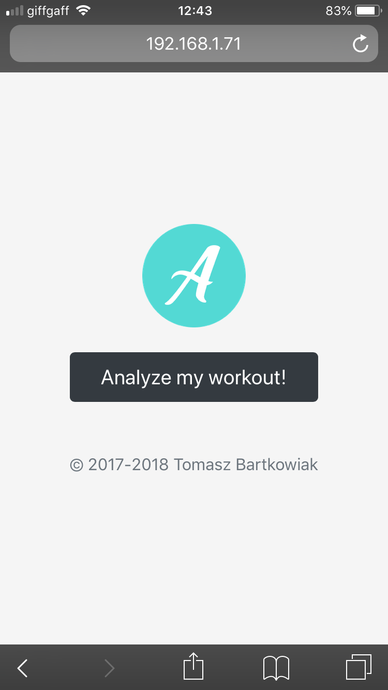
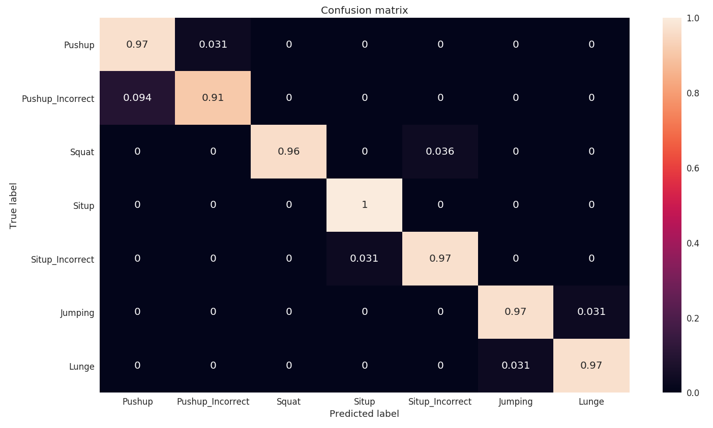
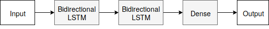
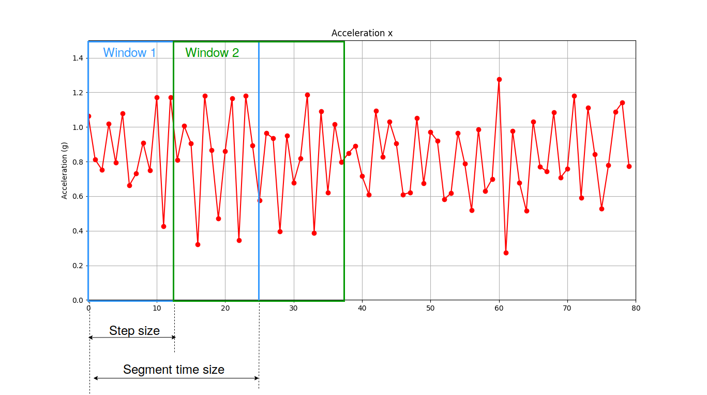
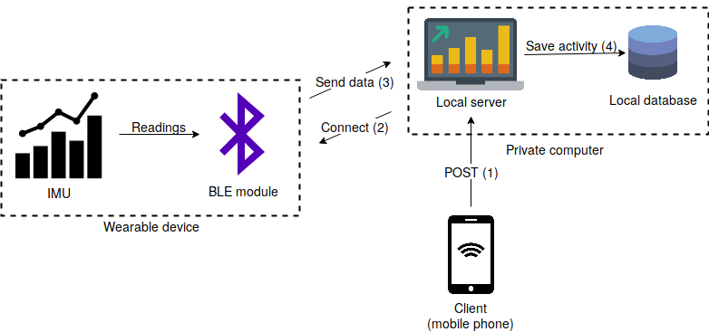
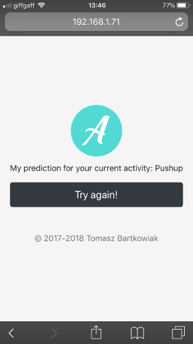
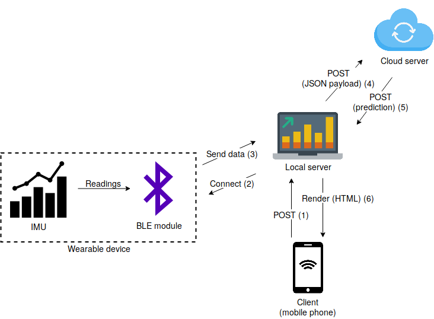
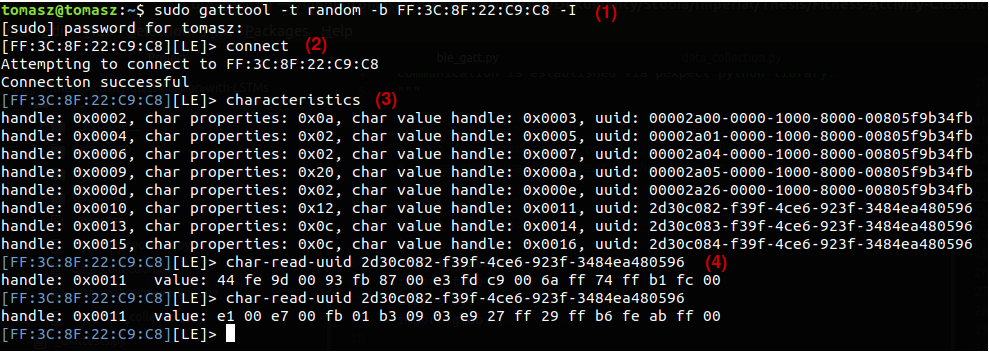

# Fitness-Activity-Classification-with-LSTMs

This repository contains code that was developed as a part of Master Thesis at Imperial College London *Movement Classification on Energy-efficient Sensor Using Neural Networks* written under the supervision of Dr Thomas Heinis.

## About
The project tackles the area of Human Activity Recognition (HAR) by utilizing Bidirectional LSTM (Recurrent Neural Networks) to build a robust classifier that recognizes fitness activities and classifies them as *correct* or *incorrect*. It achieved a performance of 96% and was built on a custom dataset consisting of over 11 thousand samples. The system recognizes seven different fitness activities: *Push-up, Push-up (incorrect), Squat, Sit-up, Sit-up (incorrect), Jumping, Lunge*. The data might be found in the `data_collected/`directory

The system is built in such a way that it can be easily adapted to custom datasets with arbitrary activities. It provides a web app *Data collection* that facilitates the data collection process. The *Analyzemyworkout* is a web application used for HAR classification.

*Data collection* application:  

  

*Analyzemyworkout* application:  

## Requirements
#####  Hardware: Inertial Measurement Unit equipped with BLE module (Here: Arduino LilyPad SimbleeBLE with MPU9250 IMU was used)
##### Software: Check file `requirements.txt`. Install with:

    pip install -r requirements.txt

## Results
The classifier achieved an overall accuracy of 96% (the model can be found in `models/` directory. The confusion matrix resulting from testing the classifier on the test set can be seen below:  

Yet the architecture is quite simple and consists of two stacked Bidirectional LSTM layers:  

The hyperparameters of the network were optimized using Bayesian optimization.

#### Data preprocessing
The data fed into the classifier is preprocessed using *Sliding window approach* where each sample after preprocessing is a single window composed of many raw samples (tuples of IMU readings, in case of 9DOF IMU - 9 numbers), as presented on a figure below:  

## Architecture
The repository consists of two systems: `Data collection system` and `Human Activity Recognition system` (aka *Analyzemyworkout*).

### Data collection system
Data collection system is a web app written in `Flask` that establishes BLE connection with a wearable device (motion sensor/IMU) and saves the data as a `.pckl` file. Its high-level architecture is presented below:  

### *Analyzemyworkout*
*Analyzemyworkout* is a web app written in `Flask` that establishes BLE connection with a wearable device (motion sensor/IMU), preprocesses data and sends to an external server for classification. After receiving the response (JSON), it renders that response on the client's browser.  

  

Its high-level architecture is presented below:  

## Use
### Training a model on a custom dataset
Motion sensor/IMU should be configured so that it sends one packet of data with IMU readings. In case of 9DOF IMU (accelerometer, gyroscope and magnetometer) the C/C++ code would look like this:

      int16_t ax, ay, az;
      int16_t gx, gy, gz;
      int16_t mx, my, mz;

      int DATA_SIZE = 2;
      memcpy(data, &ax, sizeof(ax));
      memcpy(data + 1 * DATA_SIZE, &ay, sizeof(ay));
      memcpy(data + 2 * DATA_SIZE, &az, sizeof(az));
      memcpy(data + 3 * DATA_SIZE, &gx, sizeof(gx));
      memcpy(data + 4 * DATA_SIZE, &gy, sizeof(gy));
      memcpy(data + 5 * DATA_SIZE, &gz, sizeof(gz));
      memcpy(data + 6 * DATA_SIZE, &mx, sizeof(mx));
      memcpy(data + 7 * DATA_SIZE, &my, sizeof(my));
      memcpy(data + 8 * DATA_SIZE, &mz, sizeof(mz));

      SimbleeBLE.send(data, sizeof(data));

Where `ax, ay, az, gx, gy, gz, mx, my, mz` are the IMU readings in `x,y,z` axis from `accelerometer, gyroscope and magnetometer` respectively. The variables are declared as 2-byte integers (instead of 4-byte), due to BLE packet size restrictions.
In order to establish BLE connection **MAC address**, **uuid of characteristic** and its **handle** should be known (see [GATT overview](https://www.bluetooth.com/specifications/gatt/generic-attributes-overview)).  `gatttool` and `hcitool` can be used to discover them using Command Line Interface (CLI):  

(1), (2) Connect to the device with known MAC address. (3) Discover characteristics. (4) Read particular characteristic. `pexpect` (see [documentation](https://pexpect.readthedocs.io/en/stable/)) can be used to automate the use of `gatt`.

Once sensor/IMU/wearable device is configured we can start setting up the system:

 1. Clone this repository
 2. Install required packages (see `requirements.txt`)
 3. Perform necessary config changes (see comment below)
 4. Run `data_collection.py` app in `web_app/` directory
 5. Access the web app at `http:<local_ip>:5000`
 6. Wear the sensor
 7. Select activity you want to record
 8. Perform the activity till `----- ACTIVITY SAVED ---` gets printed in the console
 9. Repeat steps 7,8 as many times as needed
 10. Merge collected samples with `merge_data.py` script
 11. Delete all samples apart from the `data_merged.pckl` file
 12. Rename the `data_merged.pckl` file to `data.pckl` and move it to `data/` directory
 13. Run `model_train_keras.py` to train the network

#### Config file
Line 3 mentions the necessity of editing `config.py` file. It consists of five "sections": `GLOBAL VARIABLES, MODEL, DATA COLLECTION/PREPROCESSING, VISUALIZE` and `BACKEND REQUEST`. `GLOBAL VARIABLES` contain global variables such as `COLUMN_NAMES` that describes all the features of the data, `LABELS_NAMES` that contains all the activities to be recognized, and data/model directories indicating where data and classification models are stored. `MODEL` section contains the hyperparameters of the LSTM model. `DATA COLLECTION/PREPROCESSING` section contains variables that need to be edited in order to establish a BLE connection: `IMU_MAC_ADDRESS` (MAC address of the wearable device), `UUID_DATA` (uuid of characteristic that contains the IMU data) and `BLE_HANDLE` (handle is a unique number associated with each characteristic). `VISUALIZE` section contains global variables specifying the dimensions of the graph if data is to be visualized in real-time. Finally, `BACKEND REQUEST` section contains the variables needed for proper functioning of web applications; user should change the values of `IP_EXTERNAL` and `IP_LOCAL`.  

### Deploying model for HAR
Once the model is trained it can be deployed and used for activity recognition. [Analyzemyworkout back-end application](https://github.com/bartkowiaktomasz/Analyzemyworkout-web-app-backend) contains a code for web application that can be deployed on a VM and used for classification.

The following steps need to be undertaken in order to deploy the app:

 1. Set up a virtual machine (VM)
 2. Allow for HTPP traffic on port 5000 on the VM
 3. Clone  [this GitHub repository](https://github.com/bartkowiaktomasz/Analyzemyworkout-web-app-backend) on the VM and this repository on the local machine (LM)
 4. Install required packages (see `requirements.txt`)
 5. Place the pretrained model `model.h5` inside a `models/` directory in the VM
 6. Change the `IP_EXTERNAL` in `config.py` on the LM for the ip of the VM
 7. Run the `analyzemyworkout.py` app found in the `web_app/` directory on the LM
 8. Access the (local) application from a smartphone at `http:<local_ip>:5000`
 9. Click `Analyzemyworkout!` and perform the activity
